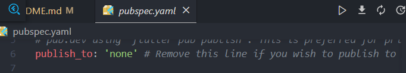
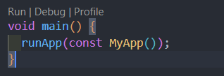
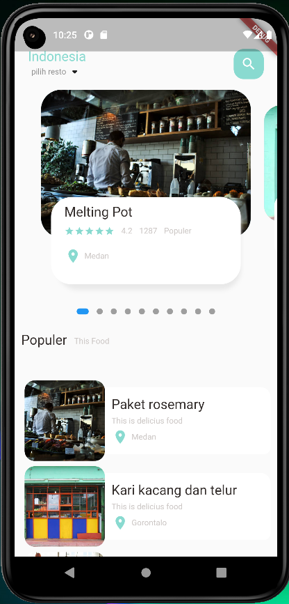
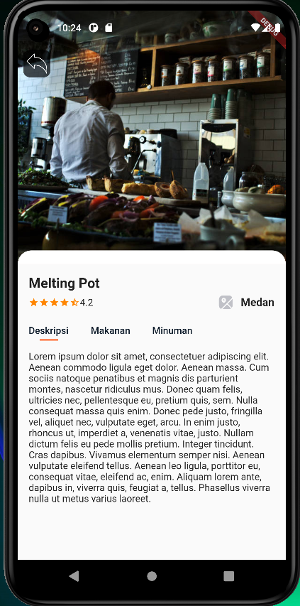

<h1 align="center">
  Restaurant App 1
</h1>

## Konten
- [Pengenalan](#Pengenalan)
- [Installasi](#Cara-Instalasi-dan-Menjalankan-di-Local-Komputer)
- [Hasil Gambar](#Hasil-Gambar)
- [Fitur](#Fitur)
- [Teknologi Yang digunakan](#Teknologi-yang-digunakan)
- [Dependensi](#dependencies)
- [Kontak](#Kontak)

## Pengenalan
Restaurant App ini adalah sebuah karya saya dalam mempelajari bahasa dan lingkungan flutter dan pengembangan Software atau mobile. Dalam pengerjaan dan pembuatan ini saya mempelajari banyak hal seperti desain UI, penggunaan stateless dan statefull widget, mengambil data dari format JSON akan tetapi masih berupa data JSON local,dan membuat desain yang responsive. Projek atau karya ini juga saya gunakan untuk pengerjaan submission dari dicoding.


## Cara Instalasi dan Menjalankan di Local Komputer
1. Lakukan Clone atau Download(```
https://github.com/Siswadi24/flutter_restaurant_app_1.git
)```
2. kemudian buka pada text editor anda masing-masing. 
3. Menuju file `pubspec.yaml` lalu lakukan `Ctrl + S` atau tekan tombol download di sebelah kanan atas seperti pada gambar dibawah ini
3. Jalankan menggunakan perintah `flutter run` atau bisa menuju dokument `main.dart` lalu klik tombol `debug` seperti pada gambar dibawah 
__*Jika masih bingung silahkan kunjungi website ini [cara menjalankan projek flutter dilocal komputer menggunakan Vs Code](https://piusaditya.medium.com/cara-clone-flutter-project-dari-github-menggunakan-visual-studio-code-3e165c2bef98)*__


## Hasil Gambar
Home Page | Detail Page |
:----------:|:-------------:|
 | 

## Fitur
- Home Page
- Populer Food
- Detail Page(Deskripsi, Makanan, Minuman)

## Teknologi yang digunakan
- Flutter
- Dart

## Dependensi
- [flutter_svg](https://pub.dev/packages/flutter_svg)
- [flutter_rating_bar](https://pub.dev/packages/flutter_rating_bar)
- [dots_indicator](https://pub.dev/packages/dots_indicator)

## Kontak
Jika anda memiliki pertanyaan atau memiliki permasalahan dalam hal menjalankan atau yang lainnya, silahkan hubungi saya melalui email di _danaperdanaputra32@gmail.com_ atau di LinkedIn saya di _www.linkedin.com/in/siswadi-perdana-putra_